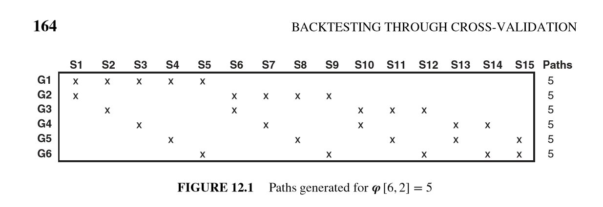
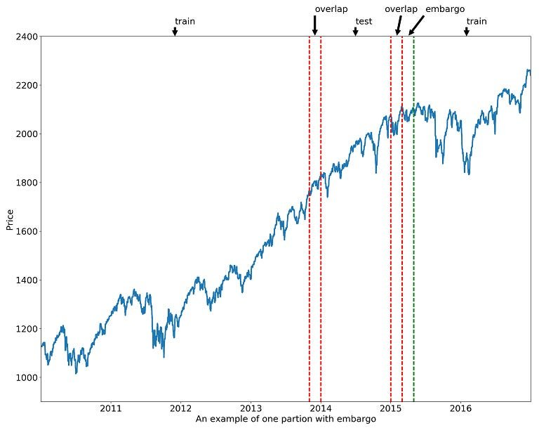

## CUSUM Filter {.smaller}

```{python}
#| output: asis
print("""
<div style="display: flex; gap: 1.5em; align-items: flex-start;">
<div style="flex: 0 0 340px; font-size: 0.72em; color: #b0b0b0; line-height: 1.55;">
<h3 style="color: #eee8d5; margin-top: 0;">Symmetric CUSUM Filter</h3>
<p><strong>Goal:</strong> Reduce ~4,200 daily bars to ~1,000 <em>informative</em> events by detecting sustained directional price moves.</p>
<p>Two accumulators track cumulative positive and negative log returns. When either exceeds threshold <em>h</em>, an event fires and both reset to zero.</p>
<p style="font-size: 0.9em; margin-top: 0.8em;">
  <code>s⁺ = max(0, s⁺ + rₜ)</code><br>
  <code>s⁻ = min(0, s⁻ + rₜ)</code><br>
  Fire when <code>s⁺ ≥ h</code> or <code>s⁻ ≤ −h</code>
</p>
<p style="font-size: 0.85em; color: #888;">AFML Snippet 2.4 · h = mult × daily_vol.mean()</p>
</div>
<div style="flex: 1;">
""")
```

```{python}
import numpy as np, pandas as pd, plotly.graph_objects as go
from plotly.subplots import make_subplots
import yfinance as yf

_df = yf.download("BTC-USD", start="2014-10-01", end="2026-03-27", auto_adjust=True, progress=False)
if isinstance(_df.columns, pd.MultiIndex):
    _df.columns = _df.columns.get_level_values(0)
_close = _df["Close"].squeeze()
_close.index = pd.to_datetime(_close.index).tz_localize(None)
_log_ret = np.log(_close / _close.shift(1)).dropna()
_daily_vol = _log_ret.ewm(span=50).std()
_base_h = _daily_vol.mean()

def _cusum(lr, h):
    events = []
    sp, sn = 0.0, 0.0
    for t, r in lr.items():
        sp = max(0, sp + r)
        sn = min(0, sn + r)
        if sp >= h:
            events.append(t); sp, sn = 0.0, 0.0
        elif sn <= -h:
            events.append(t); sp, sn = 0.0, 0.0
    return pd.DatetimeIndex(events)

_mults = [0.5, 1.0, 1.5, 2.0, 2.5, 3.0]
_cusum_res = {m: _cusum(_log_ret, m * _base_h) for m in _mults}

fig = make_subplots(rows=2, cols=1, shared_xaxes=True, row_heights=[0.65, 0.35],
                    vertical_spacing=0.06,
                    subplot_titles=["BTC Close Price + CUSUM Events", "Daily Log Returns"])

fig.add_trace(go.Scatter(x=_close.index, y=_close.values, mode='lines',
    line=dict(color='#f2a900', width=1), name='BTC Close'), row=1, col=1)
fig.add_trace(go.Scatter(x=_log_ret.index, y=_log_ret.values, mode='lines',
    line=dict(color='rgba(180,180,180,0.3)', width=0.5), name='Log Returns',
    showlegend=False), row=2, col=1)

n_base = 2
n_per = 3

for i, m in enumerate(_mults):
    evts = _cusum_res[m]
    h = m * _base_h
    vis = (m == 1.5)
    fig.add_trace(go.Scatter(x=evts, y=_close.reindex(evts).values, mode='markers',
        marker=dict(color='#e74c3c', size=4, symbol='diamond'),
        name=f'{len(evts)} events', visible=vis), row=1, col=1)
    fig.add_trace(go.Scatter(x=[_log_ret.index[0], _log_ret.index[-1]], y=[h, h],
        mode='lines', line=dict(color='#e74c3c', dash='dash', width=1),
        name='+h', visible=vis, showlegend=False), row=2, col=1)
    fig.add_trace(go.Scatter(x=[_log_ret.index[0], _log_ret.index[-1]], y=[-h, -h],
        mode='lines', line=dict(color='#e74c3c', dash='dash', width=1),
        name='−h', visible=vis, showlegend=False), row=2, col=1)

steps = []
for i, m in enumerate(_mults):
    evts = _cusum_res[m]
    h = m * _base_h
    vis = [True]*n_base + [False]*(len(_mults)*n_per)
    for j in range(n_per):
        vis[n_base + i*n_per + j] = True
    steps.append(dict(method="update", label=f"{m}×",
        args=[{"visible": vis},
              {"title": dict(text=f"CUSUM — h = {m}× σ̄ = {h:.5f} — <b>{len(evts)} events</b> from {len(_close):,} bars")}]))

fig.update_layout(
    sliders=[dict(active=2, currentvalue=dict(prefix="cusum_mult: ", font=dict(size=13)),
                  steps=steps, pad=dict(t=50), x=0.0, len=1.0, font=dict(size=11))],
    template="plotly_dark", height=520, margin=dict(l=50, r=20, t=70, b=10),
    title=dict(text=f"CUSUM — h = 1.5× σ̄ = {1.5*_base_h:.5f} — <b>{len(_cusum_res[1.5])} events</b> from {len(_close):,} bars"),
    yaxis=dict(type="log", title="Price (USD)"),
    yaxis2=dict(title="Log Return"),
    legend=dict(x=0.01, y=0.99, font=dict(size=10)),
)
fig.show()
```

```{python}
#| output: asis
print("</div></div>")
```

---

## Triple-Barrier Labeling {.smaller}

```{python}
#| output: asis
print("""
<p style="font-size: 0.72em; color: #b0b0b0; line-height: 1.5; margin-bottom: 0.6em;">
<strong>Triple-Barrier Labeling</strong> (AFML §3.4) assigns each CUSUM event a directional label by monitoring the price path 
after the event until one of three barriers is touched: an <span style="color:#2ecc71;">upper (profit-taking)</span> barrier at 
<code>p₀ × (1 + pt × σ)</code>, a <span style="color:#e74c3c;">lower (stop-loss)</span> barrier at <code>p₀ × (1 − sl × σ)</code>, 
or a <strong>vertical</strong> barrier at <code>t₀ + num_days</code>. The label is +1 (up) or −1 (down) based on which barrier is hit first.
</p>
""")
```

```{python}
def _tbl_labels(close, t_events, daily_vol, pt_sl, num_days):
    labels = []
    for t0 in t_events:
        if t0 not in daily_vol.index or pd.isna(daily_vol.loc[t0]):
            continue
        vol = daily_vol.loc[t0]
        p0 = close.loc[t0]
        upper = p0 * (1 + pt_sl[0] * vol)
        lower = p0 * (1 - pt_sl[1] * vol)
        future = close.loc[t0:]
        t1_idx = future.index.searchsorted(t0 + pd.Timedelta(days=num_days))
        t1_idx = min(t1_idx, len(future) - 1)
        t1 = future.index[t1_idx]
        path = close.loc[t0:t1]
        if len(path) < 2:
            continue
        touch_upper = path[path >= upper]
        touch_lower = path[path <= lower]
        t_upper = touch_upper.index[0] if len(touch_upper) > 0 else pd.NaT
        t_lower = touch_lower.index[0] if len(touch_lower) > 0 else pd.NaT
        candidates = {}
        if not pd.isna(t_upper): candidates[t_upper] = 1
        if not pd.isna(t_lower): candidates[t_lower] = -1
        candidates[t1] = candidates.get(t1, 0)
        first_t = min(candidates.keys())
        ret = (close.loc[first_t] - p0) / p0
        label = candidates[first_t] if first_t != t1 else int(np.sign(ret)) if ret != 0 else 0
        labels.append({"t0": t0, "t1": first_t, "ret": ret, "bin": label,
                        "upper": upper, "lower": lower, "p0": p0})
    return pd.DataFrame(labels)

_default_evts = _cusum_res[1.5]
_pt_vals = [0.5, 1.0, 1.5, 2.0, 2.5]
_nd_vals = [5, 10, 15, 20]
_tbl_combos = {}
for pt in _pt_vals:
    for nd in _nd_vals:
        res = _tbl_labels(_close, _default_evts, _daily_vol, (pt, pt), nd)
        _tbl_combos[(pt, nd)] = res[res["bin"] != 0]

_zoom = ("2025-06-01", "2025-12-31")
_zmask = (_close.index >= _zoom[0]) & (_close.index <= _zoom[1])
_zclose = _close.loc[_zmask]

fig2 = make_subplots(rows=1, cols=2, column_widths=[0.55, 0.45],
                     subplot_titles=["Barriers on BTC Price (zoom)", "Label Distribution"],
                     specs=[[{"type": "xy"}, {"type": "domain"}]])

fig2.add_trace(go.Scatter(x=_zclose.index, y=_zclose.values, mode='lines',
    line=dict(color='#f2a900', width=1.5), name='BTC Close', showlegend=False), row=1, col=1)

n_per2 = 5
combo_keys = [(pt, nd) for pt in _pt_vals for nd in _nd_vals]

for ci, (pt, nd) in enumerate(combo_keys):
    res = _tbl_combos[(pt, nd)]
    is_default = (pt == 1.5 and nd == 10)
    z_res = res[(res["t0"] >= _zoom[0]) & (res["t0"] <= _zoom[1])]
    up_x, up_y, lo_x, lo_y = [], [], [], []
    for _, row in z_res.iterrows():
        up_x += [row["t0"], row["t1"], None]; up_y += [row["upper"], row["upper"], None]
        lo_x += [row["t0"], row["t1"], None]; lo_y += [row["lower"], row["lower"], None]
    fig2.add_trace(go.Scatter(x=up_x, y=up_y, mode='lines',
        line=dict(color='rgba(46,204,113,0.5)', width=1, dash='dot'),
        visible=is_default, showlegend=False), row=1, col=1)
    fig2.add_trace(go.Scatter(x=lo_x, y=lo_y, mode='lines',
        line=dict(color='rgba(231,76,60,0.5)', width=1, dash='dot'),
        visible=is_default, showlegend=False), row=1, col=1)
    up_evts = z_res[z_res["bin"] == 1]
    dn_evts = z_res[z_res["bin"] == -1]
    fig2.add_trace(go.Scatter(x=up_evts["t0"], y=up_evts["p0"], mode='markers',
        marker=dict(color='#2ecc71', size=6, symbol='triangle-up'),
        visible=is_default, showlegend=False), row=1, col=1)
    fig2.add_trace(go.Scatter(x=dn_evts["t0"], y=dn_evts["p0"], mode='markers',
        marker=dict(color='#e74c3c', size=6, symbol='triangle-down'),
        visible=is_default, showlegend=False), row=1, col=1)
    n_up = (res["bin"] == 1).sum()
    n_dn = (res["bin"] == -1).sum()
    fig2.add_trace(go.Pie(labels=["Up (+1)", "Down (−1)"], values=[n_up, n_dn],
        marker=dict(colors=["#2ecc71", "#e74c3c"]), textinfo="label+percent",
        textfont=dict(size=13), hole=0.35, visible=is_default, showlegend=False), row=1, col=2)

# Buttons for pt_sl, slider for num_days
def _get_vis(target_pt, target_nd):
    vis = [True]  # base price
    for cj, (pt, nd) in enumerate(combo_keys):
        match = (pt == target_pt and nd == target_nd)
        for _ in range(n_per2):
            vis.append(match)
    return vis

def _tbl_title(pt, nd):
    res = _tbl_combos[(pt, nd)]
    n_up = (res["bin"] == 1).sum()
    n_dn = (res["bin"] == -1).sum()
    return f"TBL — pt_sl=({pt},{pt}), num_days={nd} — <b>{len(res)} labels</b> ({n_up} up, {n_dn} down)"

buttons_pt = []
for pt in _pt_vals:
    nd = 10
    buttons_pt.append(dict(
        method="update", label=f"pt_sl = {pt}",
        args=[{"visible": _get_vis(pt, nd)},
              {"title": dict(text=_tbl_title(pt, nd)),
               "sliders": [dict(active=_nd_vals.index(nd),
                   currentvalue=dict(prefix="num_days: ", font=dict(size=12)),
                   steps=[dict(method="update", label=str(nd2),
                       args=[{"visible": _get_vis(pt, nd2)},
                             {"title": dict(text=_tbl_title(pt, nd2))}])
                       for nd2 in _nd_vals],
                   pad=dict(t=60), x=0.0, len=1.0, font=dict(size=11))]}]))

default_slider_steps = [
    dict(method="update", label=str(nd),
         args=[{"visible": _get_vis(1.5, nd)},
               {"title": dict(text=_tbl_title(1.5, nd))}])
    for nd in _nd_vals
]

fig2.update_layout(
    updatemenus=[dict(type="buttons", direction="right", x=0.0, y=1.18, xanchor="left",
                      buttons=buttons_pt, font=dict(size=10),
                      bgcolor="rgba(255,255,255,0.05)", bordercolor="rgba(255,255,255,0.1)")],
    sliders=[dict(active=1, currentvalue=dict(prefix="num_days: ", font=dict(size=12)),
                  steps=default_slider_steps, pad=dict(t=60), x=0.0, len=1.0, font=dict(size=11))],
    template="plotly_dark", height=500, margin=dict(l=50, r=30, t=90, b=10),
    title=dict(text=_tbl_title(1.5, 10)),
    yaxis=dict(title="Price (USD)"),
)
fig2.show()
```

---

## Sample Weights {.smaller}

```{python}
#| output: asis
print("""
<p style="font-size: 0.72em; color: #b0b0b0; line-height: 1.5; margin-bottom: 0.6em;">
<strong>Sample Weights</strong> (AFML Ch. 4) account for overlapping triple-barrier labels.
For each event, <em>average uniqueness</em> measures how much its label period overlaps with others (1 = unique, 0 = fully overlapped). 
Weights combine uniqueness with absolute return attribution, then apply a linear <em>time decay</em> 
(upweighting recent data) and <em>quantile capping</em> to prevent extreme events from dominating training.
</p>
""")
```

```{python}
def _compute_weights(bins_df, full_index, decay=1.0, cap_q=0.99):
    t1_map = bins_df["t1"]
    conc = pd.Series(0, index=full_index, dtype=float)
    for t0, row in bins_df.iterrows():
        t1_val = row["t1"]
        mask = (full_index >= t0) & (full_index <= t1_val)
        conc.loc[mask] += 1
    conc = conc.clip(lower=1)
    uniq = pd.Series(np.nan, index=bins_df.index)
    for t0, row in bins_df.iterrows():
        t1_val = row["t1"]
        span = conc.loc[t0:t1_val]
        uniq.loc[t0] = (1.0 / span).mean() if len(span) > 0 else 1.0
    w = bins_df["ret"].abs() * uniq
    if w.sum() > 0:
        w = w * len(w) / w.sum()
    else:
        w = pd.Series(1.0, index=bins_df.index)
    if decay < 1.0:
        ramp = np.linspace(decay, 1.0, len(w))
        w = w * ramp
        w = w * len(w) / w.sum()
    if cap_q < 1.0:
        cap_val = w.quantile(cap_q)
        w = w.clip(upper=cap_val)
        w = w * len(w) / w.sum()
    return w

_default_bins = _tbl_combos[(1.5, 10)].set_index("t0")[["t1", "ret", "bin"]].copy()
_default_bins.index.name = None

_decay_vals = [0.25, 0.5, 0.75, 1.0]
_cap_vals = [0.95, 0.99, 1.0]
_weight_combos = {}
for d in _decay_vals:
    for c in _cap_vals:
        _weight_combos[(d, c)] = _compute_weights(_default_bins, _close.index, decay=d, cap_q=c)

fig3 = make_subplots(rows=1, cols=2, column_widths=[0.45, 0.55],
                     subplot_titles=["Weight Distribution", "Weights Over Time"])

wcombo_keys = [(d, c) for d in _decay_vals for c in _cap_vals]

for ci, (d, c) in enumerate(wcombo_keys):
    w = _weight_combos[(d, c)]
    is_default = (d == 0.5 and c == 0.99)
    fig3.add_trace(go.Histogram(x=w.values, nbinsx=50,
        marker_color='rgba(88,166,255,0.6)', marker_line=dict(color='rgba(88,166,255,0.9)', width=0.5),
        visible=is_default, showlegend=False), row=1, col=1)
    fig3.add_trace(go.Scatter(x=[w.mean(), w.mean()], y=[0, len(w)//4],
        mode='lines', line=dict(color='#e74c3c', dash='dash', width=1.5),
        visible=is_default, showlegend=False), row=1, col=1)
    fig3.add_trace(go.Scatter(x=w.index, y=w.values, mode='lines',
        line=dict(color='rgba(88,166,255,0.7)', width=0.8),
        visible=is_default, showlegend=False), row=1, col=2)

n_per3 = 3

def _get_w_vis(target_d, target_c):
    vis = []
    for cj, (d2, c2) in enumerate(wcombo_keys):
        match = (d2 == target_d and c2 == target_c)
        for _ in range(n_per3):
            vis.append(match)
    return vis

def _w_title(d, c):
    w = _weight_combos[(d, c)]
    cl = "none" if c >= 1.0 else str(c)
    return f"Sample Weights — time_decay={d}, cap_quantile={cl} — mean={w.mean():.2f}, std={w.std():.2f}, max={w.max():.2f}"

# Buttons for cap, slider for decay
buttons_cap = []
for c in _cap_vals:
    cl = "none" if c >= 1.0 else str(c)
    d = 0.5
    buttons_cap.append(dict(
        method="update", label=f"cap = {cl}",
        args=[{"visible": _get_w_vis(d, c)},
              {"title": dict(text=_w_title(d, c)),
               "sliders": [dict(active=_decay_vals.index(d),
                   currentvalue=dict(prefix="time_decay: ", font=dict(size=12)),
                   steps=[dict(method="update", label=str(d2),
                       args=[{"visible": _get_w_vis(d2, c)},
                             {"title": dict(text=_w_title(d2, c))}])
                       for d2 in _decay_vals],
                   pad=dict(t=60), x=0.0, len=1.0, font=dict(size=11))]}]))

default_decay_steps = [
    dict(method="update", label=str(d),
         args=[{"visible": _get_w_vis(d, 0.99)},
               {"title": dict(text=_w_title(d, 0.99))}])
    for d in _decay_vals
]

fig3.update_layout(
    updatemenus=[dict(type="buttons", direction="right", x=0.0, y=1.2, xanchor="left",
                      buttons=buttons_cap, font=dict(size=10),
                      bgcolor="rgba(255,255,255,0.05)", bordercolor="rgba(255,255,255,0.1)")],
    sliders=[dict(active=1, currentvalue=dict(prefix="time_decay: ", font=dict(size=12)),
                  steps=default_decay_steps, pad=dict(t=60), x=0.0, len=1.0, font=dict(size=11))],
    template="plotly_dark", height=470, margin=dict(l=50, r=30, t=90, b=10),
    title=dict(text=_w_title(0.5, 0.99)),
    xaxis=dict(title="Weight"), yaxis=dict(title="Count"),
    xaxis2=dict(title="Date"), yaxis2=dict(title="Weight"),
)
fig3.show()
```

---

## Feature Universe {.smaller}

```{python}
#| output: asis

features = {
    "Technical Analysis (23)": [
        ("log_returns", "Log price returns"),
        ("rsi", "Relative Strength Index (14)"),
        ("macd", "MACD line"),
        ("macd_signal", "MACD signal line"),
        ("macd_hist", "MACD histogram"),
        ("bb_width", "Bollinger Band width"),
        ("atr", "Average True Range (14) ᴸ"),
        ("obv", "On-Balance Volume ᴸ"),
        ("skewness", "Rolling skewness (21d)"),
        ("kurtosis", "Rolling kurtosis (21d)"),
        ("realized_vol", "Realized volatility (21d)"),
        ("gk_vol", "Garman-Klass volatility"),
        ("yz_vol", "Yang-Zhang volatility"),
        ("ema_ratio_20_50", "EMA 20/50 ratio"),
        ("ema_ratio_50_200", "EMA 50/200 ratio"),
        ("vwma_ratio_20_50", "VWMA 20/50 ratio"),
        ("roc_14", "Rate of Change (14d)"),
        ("stoch_k", "Stochastic %K"),
        ("stoch_d", "Stochastic %D"),
        ("williams_r", "Williams %R"),
        ("cci_14", "Commodity Channel Index"),
        ("chaikin_osc", "Chaikin Oscillator"),
        ("mfi_14", "Money Flow Index"),
    ],
    "Macro (13)": [
        ("dxy_roc_21", "US Dollar Index (21d RoC)"),
        ("us2y", "2Y Treasury yield"),
        ("us10y", "10Y Treasury yield"),
        ("yield_curve_2y10y", "Yield curve 2Y–10Y"),
        ("yield_curve_10y30y", "Yield curve 10Y–30Y"),
        ("vix", "CBOE Volatility Index"),
        ("sp500_ret_21", "S&P 500 (21d log ret)"),
        ("nasdaq_ret_21", "Nasdaq (21d log ret)"),
        ("gold_ret_21", "Gold (21d log ret)"),
        ("silver_ret_21", "Silver (21d log ret)"),
        ("copper_ret_21", "Copper (21d log ret)"),
        ("oil_ret_21", "WTI Crude (21d log ret)"),
        ("natgas_ret_21", "Natural Gas (21d log ret)"),
    ],
    "Crypto & On-Chain (10)": [
        ("eth_btc_ratio", "ETH/BTC price ratio"),
        ("btc_dominance", "BTC market dominance"),
        ("active_addr_roc_14", "Active addresses (14d RoC)"),
        ("tx_count_roc_14", "Transaction count (14d RoC)"),
        ("hashrate_roc_30", "Hash rate (30d RoC)"),
        ("mvrv", "Market Value to Realized Value"),
        ("net_exchange_flow", "Net exchange flow (BTC)"),
        ("fee_per_tx", "Fee per transaction"),
        ("exchange_supply_pct", "Exchange supply (%)"),
        ("issuance_ntv", "Daily BTC issuance"),
    ],
    "Mathematical — AFML Part 4 (9)": [
        ("shannon_entropy", "Rolling Shannon entropy (21d)"),
        ("lz_complexity", "Lempel-Ziv complexity (63d)"),
        ("hurst", "Hurst exponent, R/S (126d)"),
        ("variance_ratio", "Lo-MacKinlay VR (63d)"),
        ("jarque_bera", "Jarque-Bera statistic (63d)"),
        ("gaussian_entropy", "Gaussian entropy (21d)"),
        ("sadf", "Sup. ADF test statistic"),
        ("smt_poly1", "SMT polynomial spec."),
        ("smt_exp", "SMT exponential spec."),
    ],
}

cat_colors = {
    "Technical Analysis (23)": ("#3b82f6", "rgba(59,130,246,0.08)", "rgba(59,130,246,0.18)"),
    "Macro (13)": ("#10b981", "rgba(16,185,129,0.08)", "rgba(16,185,129,0.18)"),
    "Crypto & On-Chain (10)": ("#f59e0b", "rgba(245,158,11,0.08)", "rgba(245,158,11,0.18)"),
    "Mathematical — AFML Part 4 (9)": ("#a855f7", "rgba(168,85,247,0.08)", "rgba(168,85,247,0.18)"),
}

max_rows = max(len(v) for v in features.values())
categories = list(features.keys())

html = '<table class="feature-table">\n<thead>\n<tr>'
for cat in categories:
    accent, _, header_bg = cat_colors[cat]
    html += f'<th colspan="2" style="background:{header_bg}; color:{accent}; border-bottom: 2px solid {accent};">{cat}</th>'
html += '</tr>\n<tr>'
for cat in categories:
    accent, _, _ = cat_colors[cat]
    html += f'<th style="color:{accent};">Feature</th><th>Description</th>'
html += '</tr>\n</thead>\n<tbody>\n'

for i in range(max_rows):
    html += '<tr>'
    for cat in categories:
        feats = features[cat]
        accent, row_bg, _ = cat_colors[cat]
        if i < len(feats):
            name, desc = feats[i]
            html += f'<td class="feat-name" style="background:{row_bg};"><code style="color:{accent}; background:rgba(255,255,255,0.03);">{name}</code></td>'
            html += f'<td class="feat-desc" style="background:{row_bg};">{desc}</td>'
        else:
            html += f'<td style="background:{row_bg};"></td><td style="background:{row_bg};"></td>'
    html += '</tr>\n'

html += '</tbody>\n</table>'
html += '<p style="font-size: 0.55em; color: #888; margin-top: 0.3em;">ᴸ = log-transformed &nbsp;|&nbsp; All features are backward-looking (no future leakage) &nbsp;|&nbsp; 55 total features</p>'

print(html)
```

---

## CPCV Structure {.smaller}

```{python}
#| output: asis

html = """
<div style="display: flex; gap: 2em; align-items: flex-start;">

<div style="flex: 1;">
<h3 style="color: #eee8d5; margin-top: 0;">Combinatorial Purged Cross-Validation</h3>

<table class="info-table">
<tr><td>Groups (N)</td><td><strong>6</strong> contiguous blocks</td></tr>
<tr><td>Test groups (k)</td><td><strong>2</strong> per split</td></tr>
<tr><td>Splits</td><td>C(6,2) = <strong>15</strong></td></tr>
<tr><td>Backtest paths</td><td>φ(6,2) = C(5,1) = <strong>5</strong></td></tr>
<tr><td>Embargo</td><td><strong>1%</strong> of T after each test group</td></tr>
</table>

<h4 style="color: #eee8d5; margin-top: 1em;">Purging (AFML §7.1)</h4>
<p style="font-size: 0.68em; color: #b0b0b0;">
Removes <strong>training</strong> observations whose triple-barrier label 
[t₀, t₁] overlaps any test group — prevents leakage from labels that resolve in the future.
</p>

<h4 style="color: #eee8d5; margin-top: 0.6em;">Embargo (AFML §7.4)</h4>
<p style="font-size: 0.68em; color: #b0b0b0;">
Removes a buffer of observations <strong>after</strong> each test boundary 
to guard against serial correlation bleeding across the split.
</p>
</div>

<div style="flex: 1.2; display: flex; flex-direction: column; gap: 0.8em;">


</div>

</div>
"""

print(html)
```

---

## Inside the CPCV Loop {.smaller}

```{python}
#| output: asis

html = """
<p style="font-size: 0.75em; color: #b0b0b0; margin-bottom: 1.2em;">
Every stateful transformation is fitted on <strong>training data only</strong>, per fold. This is the leakage-critical zone.
</p>

<div style="display: flex; gap: 2em;">

<div class="cpcv-step-card">
<h3>① Fractional Differentiation (FFD)</h3>
<p><strong>Goal:</strong> Make non-stationary features stationary while preserving memory.</p>
<ul>
<li>Sweeps <em>d</em> from 0 → 1 (step 0.05)</li>
<li>Minimum <em>d*</em> where ADF p-value < 0.05</li>
<li><em>d*</em> estimated on training fold only</li>
<li>FFD applied to full series (test gets lookback)</li>
</ul>
<p class="detail">Applied to: <code>atr</code> &nbsp;|&nbsp; Typical d* ≈ 0.15–0.45</p>
</div>

<div class="cpcv-step-card">
<h3>② Robust Scaling</h3>
<p><strong>Goal:</strong> Normalize features without sensitivity to outliers.</p>
<ul>
<li>Centers by <strong>median</strong>, scales by <strong>IQR</strong></li>
<li>Robust to BTC's fat-tailed distributions</li>
<li>Fitted on training fold, applied to both train and test</li>
</ul>
<p class="detail">sklearn <code>RobustScaler</code> &nbsp;|&nbsp; All 55 features</p>
</div>

<div class="cpcv-step-card">
<h3>③ Multi-Model MDA</h3>
<p><strong>Goal:</strong> Select features that matter for prediction, not just for trees.</p>
<ul>
<li>Permutation importance with <strong>RF + Logistic Regression</strong></li>
<li>Purged inner 3-fold CV within each training set</li>
<li>Average MDA across both models</li>
<li>Keep features with MDA > 0, capped at 40%</li>
</ul>
<p class="detail">~18–22 features selected per fold from 55</p>
</div>

</div>
"""

print(html)
```

---

## Models {.smaller}

```{python}
#| output: asis

html = """
<div style="display: grid; grid-template-columns: repeat(3, 1fr); gap: 1.2em; margin-top: 0.5em;">

<div class="model-card baseline">
<div class="model-tag">Baseline</div>
<h3>AR Logistic</h3>
<p>Autoregressive logistic regression on lagged returns [1,2,3,5,10,21]. Ignores feature selection entirely.</p>
<div class="model-specs">C=1.0 · L2 · 3 seeds</div>
</div>

<div class="model-card ensemble">
<div class="model-tag">Ensemble</div>
<h3>Random Forest</h3>
<p>Bagged decision trees with sqrt feature sampling. Captures nonlinear interactions.</p>
<div class="model-specs">500 trees · min_leaf=5 · 3 seeds</div>
</div>

<div class="model-card deeplearning">
<div class="model-tag">Deep Learning</div>
<h3>LSTM</h3>
<p>Recurrent network with 21-day lookback windows. Captures temporal dependencies.</p>
<div class="model-specs">[n,64,64,2] · dropout=0.2 · 2 seeds</div>
</div>

<div class="model-card baseline">
<div class="model-tag">Baseline</div>
<h3>Logistic Regression</h3>
<p>Standard L2-penalized logistic on selected features. Linear benchmark for the ML models.</p>
<div class="model-specs">C=1.0 · L2 · balanced · 3 seeds</div>
</div>

<div class="model-card ensemble">
<div class="model-tag">Ensemble</div>
<h3>XGBoost</h3>
<p>Gradient-boosted trees with early stopping. Sequentially corrects errors.</p>
<div class="model-specs">300 rounds · depth=4 · lr=0.05 · 3 seeds</div>
</div>

<div class="model-card deeplearning">
<div class="model-tag">Deep Learning</div>
<h3>KAN</h3>
<p>Kolmogorov–Arnold Network with learnable spline activations. Enables symbolic extraction.</p>
<div class="model-specs">[n,5,2] · grid=5 · k=3 · AdamW · 2 seeds</div>
</div>

</div>
"""

print(html)
```

---

## Results: Confusion Matrices & Sharpe Distribution {.smaller}

```{python}
import plotly.graph_objects as go
from plotly.subplots import make_subplots
import numpy as np

_cm_data = {
    "AR Logistic (0.494)": [[825,760],[1030,925]],
    "Logistic (0.517)": [[831,754],[957,998]],
    "Random Forest (0.520)": [[722,863],[835,1120]],
    "XGBoost (0.526)": [[771,814],[864,1091]],
    "LSTM (0.508)": [[816,661],[932,831]],
    "KAN (0.509)": [[875,710],[1028,927]],
}

fig_cm = make_subplots(rows=2, cols=4,
    subplot_titles=list(_cm_data.keys()) + ["Sharpe Ratio Distribution", ""],
    horizontal_spacing=0.05, vertical_spacing=0.14,
    column_widths=[0.2, 0.2, 0.2, 0.4],
    specs=[[{"type":"heatmap"},{"type":"heatmap"},{"type":"heatmap"},{"type":"xy","rowspan":2}],
           [{"type":"heatmap"},{"type":"heatmap"},{"type":"heatmap"},None]])

_labels = ["Down", "Up"]
_colorscale = [[0, "#1a1a2e"], [0.5, "#2a5a8a"], [1, "#7ec8e3"]]

for idx, (title, cm) in enumerate(_cm_data.items()):
    r, c_col = divmod(idx, 3)
    cm_arr = np.array(cm)
    text = [[str(v) for v in row] for row in cm]
    fig_cm.add_trace(go.Heatmap(
        z=cm_arr, x=_labels, y=_labels, text=text, texttemplate="%{text}",
        textfont=dict(size=14, color="white"),
        colorscale=_colorscale, showscale=False,
        hovertemplate="True: %{y}<br>Pred: %{x}<br>Count: %{z}<extra></extra>",
    ), row=r+1, col=c_col+1)

# Sharpe boxplot
_sharpes = {
    "AR Logistic":   [-0.97, -0.68, -0.38, -0.26,  0.15],
    "Logistic":      [-0.04,  0.72,  0.90,  0.93,  0.99],
    "Random Forest": [ 0.60,  1.22,  1.32,  1.40,  1.45],
    "XGBoost":       [ 0.49,  0.76,  0.98,  1.05,  1.10],
    "LSTM":          [ 0.08,  0.10,  0.18,  0.47,  0.50],
    "KAN":           [-0.20, -0.05,  0.58,  0.65,  0.70],
}
_colors_box = {"AR Logistic":"#999","Logistic":"#999","Random Forest":"#2ecc71",
               "XGBoost":"#2ecc71","LSTM":"#f2a900","KAN":"#f2a900"}

for m, vals in _sharpes.items():
    fig_cm.add_trace(go.Box(y=vals, name=m, marker_color=_colors_box[m],
        boxmean=False, line=dict(width=1.5), width=0.5), row=1, col=4)

fig_cm.add_hline(y=0, line_dash="dash", line_color="#e74c3c", line_width=1, row=1, col=4)

fig_cm.update_layout(
    template="plotly_dark", height=560, margin=dict(l=30, r=20, t=50, b=30),
    title=dict(text="Confusion Matrices (agg. 15 splits, seed=0) & Sharpe Distribution (5 CPCV paths)", font=dict(size=13)),
    showlegend=False,
)
for idx in range(6):
    r, c_col = divmod(idx, 3)
    fig_cm.update_xaxes(tickfont=dict(size=9), row=r+1, col=c_col+1)
    fig_cm.update_yaxes(tickfont=dict(size=9), row=r+1, col=c_col+1)
fig_cm.update_yaxes(title_text="Annualized Sharpe", row=1, col=4)

fig_cm.show()
```

---

## Model Comparison {.smaller}

```{python}
_comp = [
    {"rank":1,"model":"Random Forest","med_sharpe":1.3247,"std":0.3545,"dsr":0.0000,"f1":0.4606,"acc":0.5232,"ll":0.7001,"auc":0.5026,"dd":-0.2099,"cum_ret":0.8446,"wr":0.5968,"pf":1.6388},
    {"rank":2,"model":"XGBoost",      "med_sharpe":0.9813,"std":0.4168,"dsr":0.0000,"f1":0.5050,"acc":0.5258,"ll":0.7066,"auc":0.5167,"dd":-0.5096,"cum_ret":1.5153,"wr":0.5323,"pf":1.2377},
    {"rank":3,"model":"Logistic",     "med_sharpe":0.8987,"std":0.4285,"dsr":0.0000,"f1":0.4572,"acc":0.5202,"ll":0.6983,"auc":0.5464,"dd":-0.2183,"cum_ret":0.7275,"wr":0.5423,"pf":1.3145},
    {"rank":4,"model":"KAN",          "med_sharpe":0.5760,"std":0.5338,"dsr":0.0000,"f1":0.4889,"acc":0.5122,"ll":0.6954,"auc":0.5267,"dd":-0.2411,"cum_ret":0.4894,"wr":0.5366,"pf":1.1742},
    {"rank":5,"model":"LSTM",         "med_sharpe":0.1811,"std":0.2021,"dsr":0.0000,"f1":0.4586,"acc":0.5068,"ll":0.7000,"auc":0.5173,"dd":-0.3334,"cum_ret":0.0545,"wr":0.5116,"pf":1.1055},
    {"rank":6,"model":"AR Logistic",  "med_sharpe":-0.3836,"std":0.4338,"dsr":0.0000,"f1":0.4290,"acc":0.5034,"ll":0.7009,"auc":0.5013,"dd":-0.3800,"cum_ret":-0.2040,"wr":0.4689,"pf":0.8750},
]

fig_t = go.Figure(data=[go.Table(
    header=dict(
        values=["<b>#</b>","<b>Model</b>","<b>Med. Sharpe</b>","<b>Std Sharpe</b>","<b>DSR</b>",
                "<b>Mean F1</b>","<b>Mean Acc</b>","<b>Log-Loss</b>","<b>AUC-ROC</b>",
                "<b>Max DD</b>","<b>Cum. Ret</b>","<b>Win Rate</b>","<b>Profit Factor</b>"],
        fill_color="rgba(255,255,255,0.08)",
        font=dict(color="#eee8d5", size=15),
        align="center",
        line_color="rgba(255,255,255,0.12)",
        height=40,
    ),
    cells=dict(
        values=[
            [r["rank"] for r in _comp],
            [f"<b>{r['model']}</b>" for r in _comp],
            [f"{r['med_sharpe']:+.4f}" for r in _comp],
            [f"{r['std']:.4f}" for r in _comp],
            [f"{r['dsr']:.4f}" for r in _comp],
            [f"{r['f1']:.4f}" for r in _comp],
            [f"{r['acc']:.4f}" for r in _comp],
            [f"{r['ll']:.4f}" for r in _comp],
            [f"{r['auc']:.4f}" for r in _comp],
            [f"{r['dd']:.2%}" for r in _comp],
            [f"{r['cum_ret']:+.2%}" for r in _comp],
            [f"{r['wr']:.4f}" for r in _comp],
            [f"{r['pf']:.4f}" for r in _comp],
        ],
        fill_color=[
            ["rgba(46,204,113,0.12)","rgba(46,204,113,0.06)","rgba(255,255,255,0.02)",
             "rgba(242,169,0,0.08)","rgba(255,255,255,0.02)","rgba(231,76,60,0.06)"]]*13,
        font=dict(color="#d0d0d0", size=14),
        align="center",
        line_color="rgba(255,255,255,0.06)",
        height=38,
    ),
)])

fig_t.update_layout(
    template="plotly_dark", height=450, margin=dict(l=10, r=10, t=60, b=10),
    title=dict(text="Model Comparison — Ranked by Median Sharpe &nbsp;|&nbsp; DSR = 0.00 (all models) &nbsp;|&nbsp; PBO = 0.00",
               font=dict(size=15)),
)
fig_t.show()
```

---

## KAN Symbolic Extraction {.smaller}

```{python}
#| output: asis

html_kan = """
<div style="display: flex; gap: 2em; align-items: flex-start;">

<div style="flex: 1;">
<h3 style="color: #f2a900; margin-top: 0; font-size: 0.85em;">Symbolic Pipeline (Last CPCV Fold)</h3>
<table class="info-table" style="font-size: 0.75em;">
<tr><td>Architecture</td><td>[n → 5 → 2], grid=5, k=3</td></tr>
<tr><td>Top features used</td><td>5 (by CPCV selection stability)</td></tr>
<tr><td>Symbolification rate</td><td>~90%</td></tr>
<tr><td>Pre-symbolic accuracy</td><td style="color: #e74c3c;">39.73%</td></tr>
<tr><td>Post-symbolic accuracy</td><td style="color: #2ecc71;">54.79%</td></tr>
</table>
</div>

<div style="flex: 1;">
<h3 style="color: #eee8d5; margin-top: 0; font-size: 0.85em;">Surviving Features</h3>
<ul style="font-size: 0.75em; color: #d0d0d0; line-height: 1.8;">
  <li><code style="color: #f2a900;">yield_curve_10y30y</code> — Macro (10Y–30Y Treasury spread)</li>
  <li><code style="color: #f2a900;">btc_dominance</code> — Crypto ecosystem</li>
  <li><code style="color: #f2a900;">natgas_ret_21</code> — Macro (energy commodity, 21d return)</li>
</ul>
<p style="font-size: 0.65em; color: #888; margin-top: 0.5em;">
<strong>Key insight:</strong> No technical indicator survived symbolification. 
The KAN's formula relies entirely on macro and crypto-ecosystem signals.
</p>
</div>

</div>

<h4 style="color: #eee8d5; margin-top: 0.8em; font-size: 0.75em;">Decision Function &nbsp;→&nbsp; P(up) = σ(f(x))</h4>
<div style="background: rgba(0,0,0,0.3); border: 1px solid rgba(255,255,255,0.08); border-radius: 6px; padding: 0.7em 1em; font-family: monospace; font-size: 0.42em; color: #d0d0d0; line-height: 1.6; overflow-x: auto;">

<span style="color:#f2a900;">f(x)</span> = 
<span style="color:#93c5fd;">257/945</span> · sin(−btc_dom/146 + <span style="color:#93c5fd;">5561/983</span>·yc₁₀ᵧ₃₀ᵧ + <span style="color:#93c5fd;">271/419</span>·cos(<span style="color:#93c5fd;">2061/868</span>·natgas − <span style="color:#93c5fd;">1175/242</span>) + <span style="color:#93c5fd;">1135/432</span>)
+ <span style="color:#93c5fd;">273/535</span> · sin(−<span style="color:#93c5fd;">6/895</span>·btc_dom + <span style="color:#93c5fd;">1844/333</span>·yc₁₀ᵧ₃₀ᵧ + <span style="color:#93c5fd;">547/864</span>·cos(<span style="color:#93c5fd;">2061/868</span>·natgas − <span style="color:#93c5fd;">1175/242</span>) + <span style="color:#93c5fd;">2451/962</span>)
+ <span style="color:#93c5fd;">65/116</span> · tanh(<span style="color:#93c5fd;">2868/463</span>·exp(<span style="color:#93c5fd;">369/511</span>·yc₁₀ᵧ₃₀ᵧ) − <span style="color:#93c5fd;">5737/839</span>·cos(<span style="color:#93c5fd;">1238/447</span>·btc_dom + <span style="color:#93c5fd;">2931/407</span>) − <span style="color:#93c5fd;">2425/996</span>·cos(<span style="color:#93c5fd;">569/312</span>·natgas − <span style="color:#93c5fd;">3976/835</span>) + <span style="color:#93c5fd;">829/263</span>)
+ <span style="color:#93c5fd;">446/989</span> · atan(<span style="color:#93c5fd;">7717/881</span>·exp(<span style="color:#93c5fd;">369/511</span>·yc₁₀ᵧ₃₀ᵧ) − <span style="color:#93c5fd;">1199/124</span>·cos(<span style="color:#93c5fd;">1238/447</span>·btc_dom + <span style="color:#93c5fd;">2931/407</span>) − <span style="color:#93c5fd;">754/219</span>·cos(<span style="color:#93c5fd;">569/312</span>·natgas − <span style="color:#93c5fd;">3976/835</span>) + <span style="color:#93c5fd;">2933/642</span>)
− <span style="color:#93c5fd;">631/861</span>

</div>
"""

print(html_kan)
```

---

## {background-color="#f0f4f8"}

```{mermaid}
%%{init: {'theme': 'base', 'themeVariables': {'primaryColor': '#dbeafe', 'primaryTextColor': '#1e293b', 'primaryBorderColor': '#3b82f6', 'lineColor': '#64748b', 'secondaryColor': '#dcfce7', 'tertiaryColor': '#fef9c3', 'fontFamily': 'system-ui', 'fontSize': '14px'}}}%%

graph LR
    subgraph P1["Phase 1 — Pre-CPCV"]
        A["Data Retrieval\nBTC-USD OHLCV\nOct 2014 – Mar 2026"] --> B["CUSUM Filter\nh = 1.5× σ̄\n~4,200 → ~911"]
        B --> C["Triple-Barrier\npt_sl=1.5, 10 days\nBinary labels"]
        C --> D["Sample Weights\nUniqueness × |ret|\ndecay=0.5, cap=99th"]
        D --> E["Feature Engineering\n23 TA + 9 Math\n13 Macro + 10 On-chain"]
    end

    subgraph P2["Phase 2 — CPCV"]
        F["CPCV Splits\nN=6, k=2\n15 splits, 5 paths"] --> G["FFD → Scale → MDA\nper fold, train only\n~22 features"]
        G --> H["Model Training\n6 models × 15 folds\nCalibration"]
    end

    subgraph P3["Phase 3 — Evaluation"]
        I["Path Stitching\n5 backtest paths\nwith tx costs"] --> J["Comparison\nSharpe, F1, AUC\nDSR, PBO"]
        J --> K["Symbolic\nPyKAN prune\n→ formula"]
        K --> L["P up = σ f x"]
    end

    E --> F
    H --> I

    style P1 fill:#dbeafe,stroke:#3b82f6,stroke-width:2px
    style P2 fill:#dcfce7,stroke:#10b981,stroke-width:2px
    style P3 fill:#fef9c3,stroke:#f59e0b,stroke-width:2px
    style L fill:#fde68a,stroke:#f59e0b,stroke-width:2px
```

::: {style="text-align: center; font-size: 0.65em; color: #666; margin-top: 0.5em;"}
Petr Terletskiy · MSc Mathematical Finance, ISEG · 2024/26
:::
